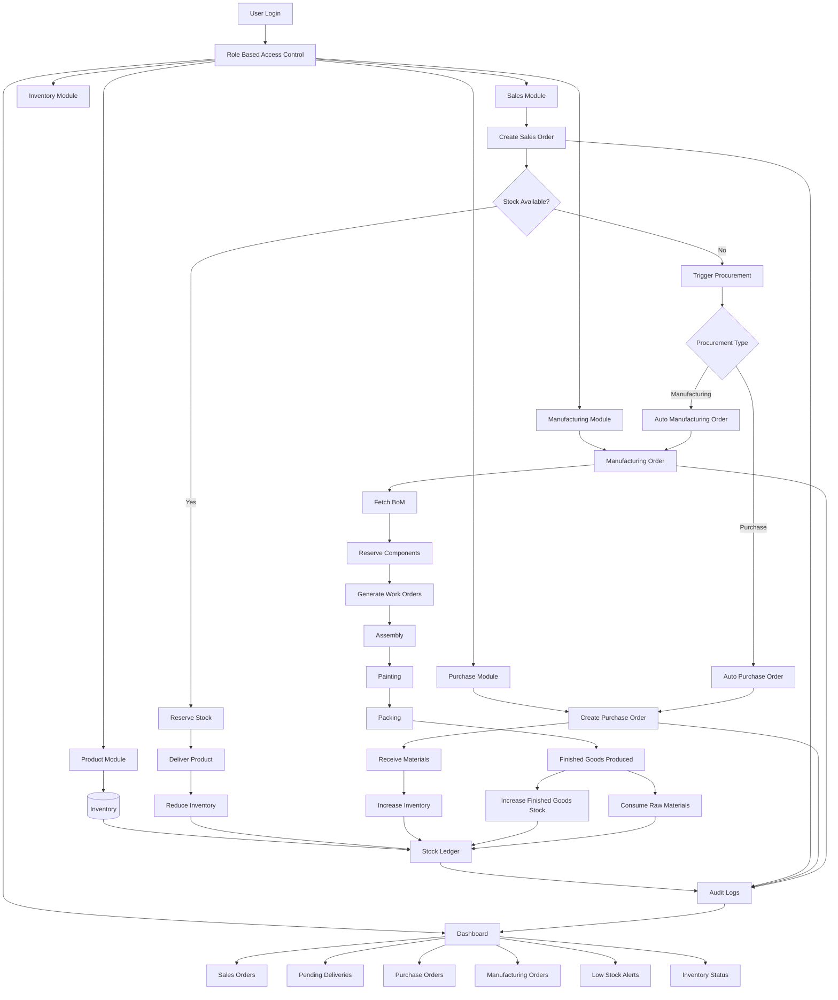

# Mini-ERP

Mini-ERP is a full-stack Enterprise Resource Planning (ERP) application. It is designed to handle core business operations including Sales, Purchasing, Manufacturing, and Inventory Management, all supported by a robust Role-Based Access Control (RBAC) system.

## Features

- **Role-Based Access Control (RBAC):** Distinct roles for Admin, Sales, Purchase, Manufacturing, Inventory Management, and Business Owners.
- **Product & Inventory Management:** Track stock levels, reserve components, and auto-trigger procurement based on demand.
- **Sales Flow:** Create Sales Orders, check stock availability, and automatically trigger procurement (Purchase or Manufacturing) if stock is insufficient.
- **Purchase Flow:** Manage vendors, create Purchase Orders, and receive materials into inventory.
- **Manufacturing Flow:** Manage Bill of Materials (BoM), Work Centers, Work Orders, and Manufacturing Orders. Tracks raw material consumption and finished goods production.
- **Stock Ledger & Audit Logs:** A comprehensive stock ledger for tracking all inventory movements, combined with detailed audit logs for actions taken across modules.
- **Dashboard & KPIs:** Centralized dashboard to view pending deliveries, low stock alerts, sales orders, purchase orders, and inventory status.

## Architecture & Flow

The following diagram illustrates the overall system flow and interactions between different modules:

## Tech Stack

- **Backend:** Node.js with [Prisma ORM](https://www.prisma.io/) (PostgreSQL)
- **Frontend:** Modern JavaScript/TypeScript framework (details in the frontend directory)
- **Database:** PostgreSQL

## Getting Started

1. Navigate to the `backend` directory.
2. Install dependencies.
3. Configure your `.env` file with `DATABASE_URL`.
4. Run Prisma migrations: `npx prisma migrate dev`.
5. Start the backend server.
6. Navigate to the `frontend` directory, install dependencies, and start the client.