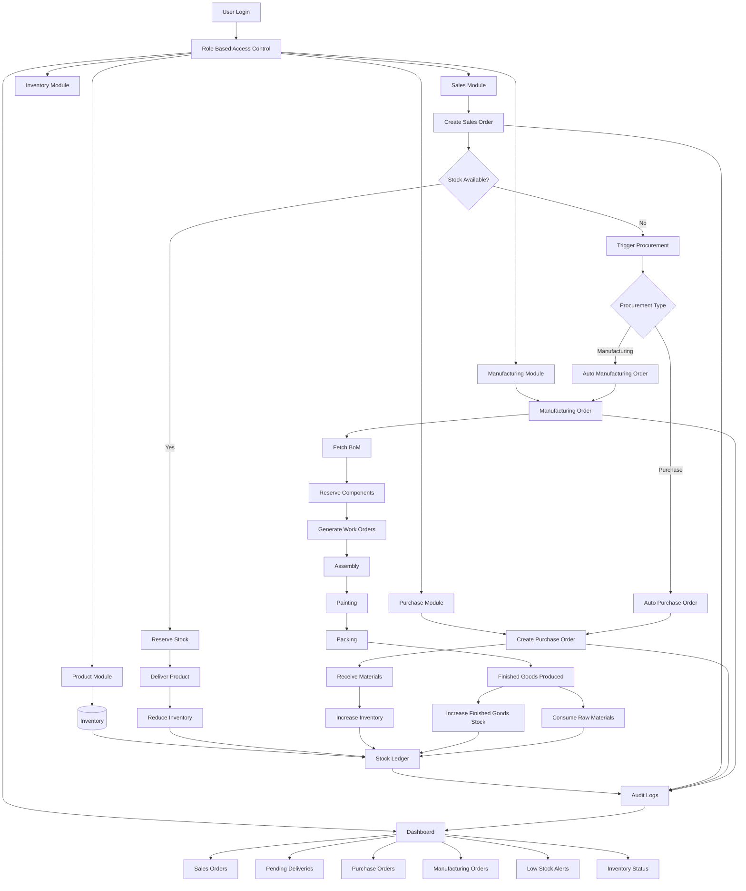

# Rapid Enterprise

> A full-stack Enterprise Resource Planning (ERP) platform for managing core business operations including Sales, Purchasing, Manufacturing, and Inventory.
---

## App Flow



---

## Tech Stack

| Layer      | Technology                                   |
| ---------- | -------------------------------------------- |
| Frontend   | React, Vite, CSS / Tailwind CSS              |
| Backend    | Node.js, Express.js                          |
| Database   | PostgreSQL via Prisma ORM                    |

---

## Features

- **Multi-Tenancy Support** — Logically isolated environments allowing multiple companies/tenants to operate securely on a single platform instance.
- **Role-Based Access Control (RBAC) & Invites** — Distinct roles for Admin, Sales, Purchase, Manufacturing, Inventory Management, and Business Owners, complete with a secure User Invite system.
- **Product & Inventory Management** — Track stock levels, reserve components, and auto-trigger procurement based on demand with detailed replenishment tracking (`NOT_STARTED`, `TRIGGERED`, `IN_PROGRESS`, `COMPLETED`).
- **Sales Flow** — Create Sales Orders, check stock availability, and automatically trigger procurement (Purchase or Manufacturing) if stock is insufficient.
- **Purchase Flow** — Manage vendors, create Purchase Orders, and receive materials into inventory.
- **Manufacturing Flow** — Manage Bill of Materials (BoM), Work Centers, Work Orders, and Manufacturing Orders. Tracks raw material consumption and finished goods production.
- **Stock Ledger & Audit Logs** — A comprehensive stock ledger for tracking all inventory movements, combined with detailed audit logs for actions taken across modules.
- **Dashboard & KPIs** — Centralized dashboard to view pending deliveries, low stock alerts, sales orders, purchase orders, and inventory status.

---

## Database Schema

Key design decisions:

- **Multi-Tenant Architecture** — Almost every core model includes a `tenantId` (with composite unique constraints like `[tenantId, email]`, `[tenantId, sku]`) to enforce strict data isolation between different companies.
- **Enums for Statuses** — Standardized statuses for Sales (`DRAFT`, `CONFIRMED`, `DELIVERED`, etc.), Purchase (`DRAFT`, `SENT`, `PARTIALLY_RECEIVED`, `RECEIVED`, `CANCELLED`), and Replenishment.
- **Granular Stock Movements** — Explicit tracking using `StockMovementType` (e.g., `SALE_RESERVE`, `SALE_RELEASE`, `SALE_DELIVERY`, `PURCHASE_RECEIPT`, `MANUFACTURING_CONSUME`, `MANUFACTURING_PRODUCE`).
- **Centralized Stock Engine** — Stock quantities (`onHandQty`, `reservedQty`) are maintained implicitly via Stock Ledger movements and should not be updated directly.
- **Strict Cascading** — Managed relations via Prisma's `onDelete: Cascade` for lines inside Sales, Purchase, and Manufacturing Orders.
- **Comprehensive Audit Trails** — The `AuditLog` model tracks changes across modules, logically separated per tenant, and linked to respective users, orders, and entities.

---

## Project Structure

```
odoo_Mini-ERP/
├── frontend/               # React + Vite client
│   └── src/
│       ├── api/            # API service calls
│       ├── components/     # Reusable UI components
│       ├── hooks/          # Custom React hooks
│       ├── pages/          # Route-level pages
│       ├── routes/         # React Router configurations
│       └── store/          # Global state management
│
└── backend/                # Express.js API server
    ├── prisma/
    │   └── schema.prisma   # Database schema
    └── src/
        ├── config/         # Environment variables & DB config
        ├── middleware/     # Auth guards, error handlers
        ├── modules/        # Feature modules (sales, inventory, manufacturing, etc.)
        └── utils/          # Helpers & utilities
```

---

## API Overview

All endpoints return a consistent envelope:

```json
{ "success": true,  "message": "...", "data": { ... } }
{ "success": false, "message": "...", "errors": [ ... ] }
```

### Auth — `/api/v1/auth`

| Method | Route              | Description          |
| ------ | ------------------ | -------------------- |
| POST   | `/login`           | Login, returns token |
| POST   | `/register`        | Register new user    |

### Products & Inventory — `/api/v1/products`

| Method | Route       | Description              |
| ------ | ----------- | ------------------------ |
| GET    | `/`         | Get all products         |
| POST   | `/`         | Create new product       |
| GET    | `/:id`      | Get product details      |
| PATCH  | `/:id`      | Update product           |

### Sales — `/api/v1/sales`

| Method | Route       | Description              |
| ------ | ----------- | ------------------------ |
| GET    | `/`         | Get all sales orders     |
| POST   | `/`         | Create sales order       |
| GET    | `/:id`      | Get sales order details  |

### Purchase — `/api/v1/purchase`

| Method | Route       | Description              |
| ------ | ----------- | ------------------------ |
| GET    | `/`         | Get all purchase orders  |
| POST   | `/`         | Create purchase order    |

### Manufacturing — `/api/v1/manufacturing`

| Method | Route       | Description              |
| ------ | ----------- | ------------------------ |
| GET    | `/`         | Get all manufacturing orders|
| POST   | `/`         | Create MO                |

---
## License

MIT
